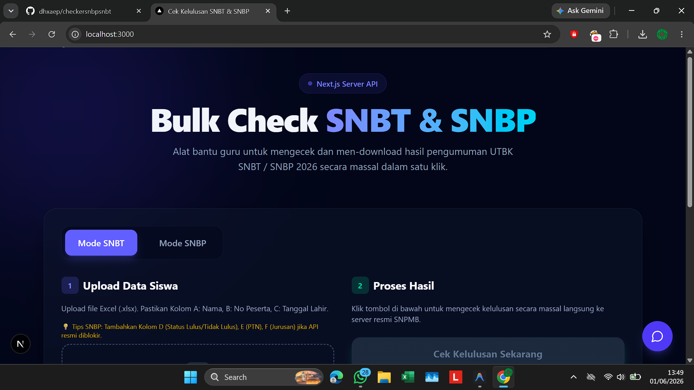
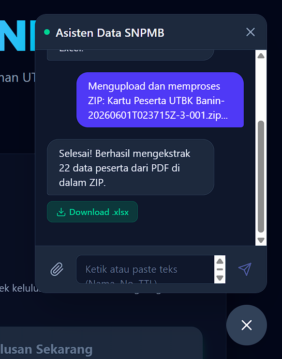

# Bulk SNBT & SNBP Result Checker & Generator
**Dibuat oleh: Dhafa Achmad Ghifari**  
**Dipersembahkan untuk: SMA Al Minhaj**

Aplikasi web modern berbasis Next.js (React) yang dirancang khusus untuk mempermudah sekolah, panitia, atau bimbingan belajar dalam mengecek kelulusan siswa pada seleksi SNBP dan SNBT secara massal (bulk), serta mencetak kartu kelulusan mereka secara otomatis ke dalam format ZIP.




---

## ✨ Fitur Unggulan

1. **Pengecekan Massal (Bulk Check)**
   Cukup unggah satu file Excel berisi daftar siswa, dan biarkan robot (Puppeteer) mengecek status kelulusan mereka satu per satu secara otomatis ke server resmi kementerian (SNPMB). Menghemat waktu berjam-jam pengecekan manual!

2. **Otomatisasi Sertifikat & Pengunduhan ZIP**
   Jika siswa dinyatakan "Lulus", aplikasi akan secara otomatis membuatkan desain Sertifikat Kelulusan resmi (biru untuk SNBP, ungu untuk SNBT) lengkap dengan nama, nomor peserta, kampus, dan jurusan yang diterima. Semua sertifikat ini dikemas rapi dalam satu file `.zip`.

3. **Asisten ChatBot Konverter Data (No API Key Needed)**
   Dilengkapi dengan ChatBot cerdas di sudut kiri bawah layar yang bekerja 100% lokal di komputer Anda:
   - **Teks Berantakan ke Excel:** Ketik atau *copy-paste* daftar nama, nomor peserta, dan tanggal lahir yang dikirim siswa via WhatsApp. Asisten akan otomatis memilahnya menjadi format tabel Excel yang rapi. Mendukung format tanggal Indonesia (contoh: "18 Mei 2008").
   - **Ekstraksi PDF dari ZIP:** Anda bisa mengunggah file `.zip` berisi kumpulan Kartu Ujian (PDF) milik siswa. Asisten akan menelusuri isi dokumen tersebut, menarik data nama, nomor ujian, dan TTL, lalu menyulapnya menjadi file `.xlsx` yang siap pakai!

4. **100% Siap Deploy ke Netlify (Serverless Ready)**
   Aplikasi ini telah direfaktor agar menggunakan *browser* teringan `@sparticuz/chromium`. Ini memungkinkannya untuk di-_hosting_ di Vercel atau Netlify secara **gratis** tanpa memicu *error limit 50MB* atau kehabisan RAM.

5. **Antarmuka (UI) Eksklusif dan Responsif**
   Mengusung desain kaca (*glassmorphism*), warna gelap elegan, animasi mulus, serta nama-nama jurusan yang tertulis lengkap (tanpa terpotong "...") untuk kemudahan membaca. Dilengkapi dengan *pop-up Welcome* sebagai bentuk apresiasi bagi pengguna baru.

---

## 🚀 Panduan Penggunaan

### A. Persiapan File Data
Anda membutuhkan file Excel (.xlsx) dengan kolom berikut secara berurutan:
1. Kolom A: `Nama Siswa`
2. Kolom B: `Nomor Peserta` (12 Digit untuk SNBT / 9-12 Digit untuk SNBP)
3. Kolom C: `Tanggal Lahir` (Format DDMMAAAA, contoh: 18052008)

*💡 **Tips:** Jika Anda tidak punya file Excel, Anda bisa memanfaatkan fitur **ChatBot Asisten** di pojok kiri bawah web untuk men-generate file Excel ini dari pesan teks atau kumpulan PDF Kartu Ujian siswa!*

### B. Cara Cek Kelulusan
1. Buka halaman utama aplikasi.
2. Terdapat tombol Mode di atas layar: **Mode SNBT** (Warna Ungu) dan **Mode SNBP** (Warna Biru). Klik sesuai jalur seleksi yang ingin Anda periksa.
3. Klik kotak unggah (atau *drag-and-drop*) file Excel `.xlsx` yang sudah Anda persiapkan.
4. Tabel akan muncul menampilkan daftar seluruh siswa Anda dengan status "Menunggu...".
5. Klik tombol besar **"Cek Kelulusan Sekarang"** di bawah halaman.
6. Duduk manis! Anda akan melihat status siswa berubah satu per satu menjadi "Lulus" atau "Tidak Lulus", lengkap dengan nama Universitas dan Jurusan jika mereka diterima.

### C. Mengunduh Hasil
- **Unduh Satuan:** Untuk siswa yang lulus (serta siswa SNBT yang tidak lulus), Anda bisa mengklik tombol panah ke bawah di ujung kanan baris nama mereka untuk mengunduh fotonya.
- **Unduh Massal (Rekomendasi):** Setelah semua proses selesai, klik tombol **"Download Semua ZIP"** di bagian atas tabel. Aplikasi akan merangkum seluruh foto kelulusan ke dalam satu file ZIP. (Khusus SNBP, hanya siswa yang lolos seleksi yang akan masuk ke dalam ZIP).

---

## 🛠️ Cara Instalasi & Menjalankan di Lokal

Aplikasi ini sangat mudah dijalankan di laptop atau PC Anda (Windows/Mac/Linux).

1. **Pastikan Node.js Terinstall:** Download dan install Node.js (versi 18 ke atas) dari [nodejs.org](https://nodejs.org/).
2. **Buka Terminal:** Buka CMD / PowerShell / Terminal, lalu arahkan ke folder proyek ini.
3. **Install Modul:** Ketik perintah berikut lalu tekan Enter:
   ```bash
   npm install
   ```
4. **Jalankan Aplikasi:** Ketik perintah berikut:
   ```bash
   npm run dev
   ```
5. Buka Browser (Chrome/Edge), lalu akses alamat: **http://localhost:3000**

---

### Catatan Teknis (Bagi Developer)
Aplikasi ini menggunakan:
- **Next.js 16+ (App Router)** dengan Turbopack.
- **Tailwind CSS v4** untuk keseluruhan desain UI/UX.
- **Puppeteer Core & Sparticuz Chromium:** Untuk mem-*bypass* perlindungan CanvasKit/Cloudflare dari web SNPMB secara *headless*.
- **pdf-parse & jszip:** Digunakan di sisi server (API Route) untuk membaca teks dari dalam PDF tanpa menggunakan API eksternal (100% aman dan lokal).

> *Dibuat dengan sepenuh hati untuk kemajuan pendidikan di SMA Al Minhaj.*
